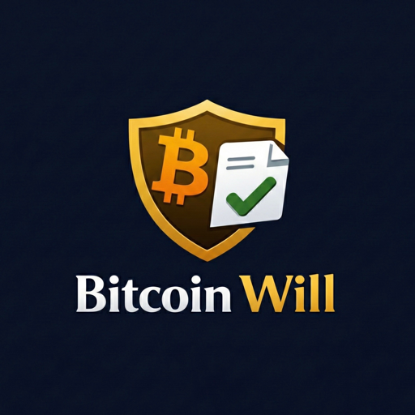

<p align="center">
  
</p>

# Bitcoin Will 🔐

A minimal, privacy-first web application for creating non-custodial Bitcoin inheritance spending plans.

## Status: MVP / Educational & Practical Tool
This project is an **initial release (v0.1.0)**. It is a functional tool for generating Bitcoin-native scripts, but it should be treated as experimental. Always verify your generated scripts and test with small amounts of Testnet Bitcoin before moving to Mainnet.

## What is this?
Bitcoin Will is a **stateless, client-side utility** that helps you create a "Dead Man's Switch" for your Bitcoin. It is built on the Time-lock Inheritance Protocol (TIP) and generates a unique Vault Address with a built-in rule: you can spend your funds at any time, but if you remain inactive for a specified delay, a beneficiary can claim the funds using their own key.

## Why this exists
Inheritance in the Bitcoin space is often either too complex (multisig setups) or too centralized (custodians). We wanted to build the simplest possible implementation of a **Relative Timelock (CSV)** spending plan that is:
1. **Easy to understand:** No complex smart contract logic.
2. **Easy to backup:** A single JSON file (the Recovery Kit) contains everything needed.
3. **Sovereign:** No accounts, no servers, no middleman.

## Who is this for?
- **Sovereign Individuals:** Those who want a simple, math-based recovery plan.
- **Privacy Advocates:** Users who refuse to provide KYC or email addresses for security tools.
- **Bitcoin Educators:** A practical way to see Bitcoin scripts in action.

## Who is this NOT for?
- **Legal Advice:** This is not a legal will. It does not replace estate laws in your jurisdiction.
- **Active Monitoring:** The app does not watch the blockchain for you. Your beneficiary must be proactive.
- **Key Loss Protection:** If you lose both your private keys AND your Recovery Kit, funds are gone.

## How to try it safely
1. **Use Testnet:** The app defaults to Testnet. Use a testnet faucet to get "fake" coins.
2. **Verify the Address:** Check the generated Vault Address in a blockchain explorer.
3. **Simulate Recovery:** Wait for the delay to pass and use an advanced wallet to attempt a claim.
4. **Offline Use:** For maximum safety, you can download this repository and run it on an air-gapped machine.

## Documentation
- [Learning Center](./docs/LEARNING.md) - Concepts for beginners.
- [Protocol Specification](./PROTOCOL.md) - Technical deep-dive into the script logic.
- [Security Policy](./SECURITY.md) - Threat model and safety tips.
- [API Reference](./src/lib/bitcoin/README.md) - Bitcoin module documentation.
- [Testing Guide](./TESTING.md) - How to run and write tests.
- [Troubleshooting](./docs/TROUBLESHOOTING.md) - Common issues and solutions.

## Tech Stack
- **Frontend:** React + Vite + TypeScript
- **Styling:** Tailwind CSS (Bitcoin Orange Theme)
- **Logic:** `bitcoinjs-lib` for script and address derivation.
- **Hosting:** 100% static (No backend, no database).

## Getting Started
```bash
npm install
npm run dev
```

## License
MIT